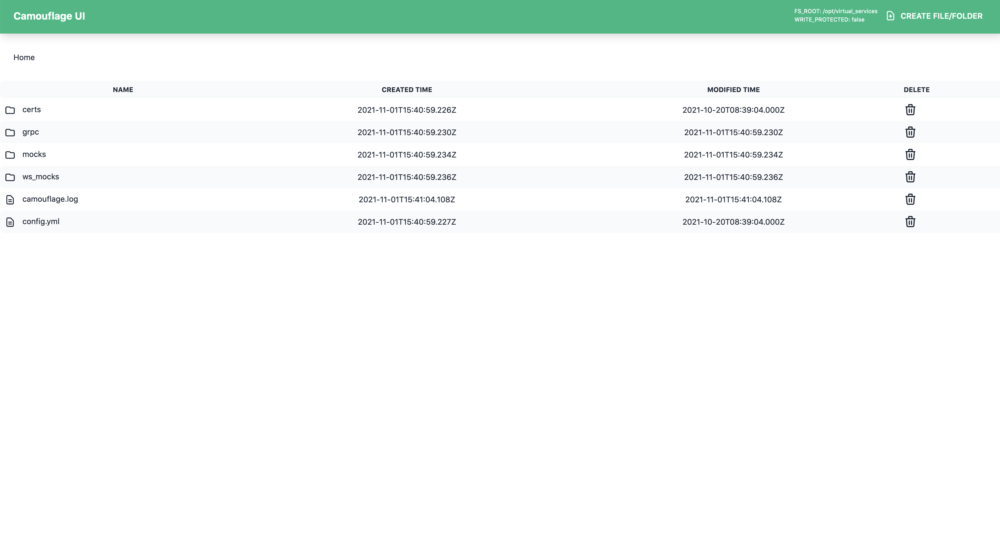
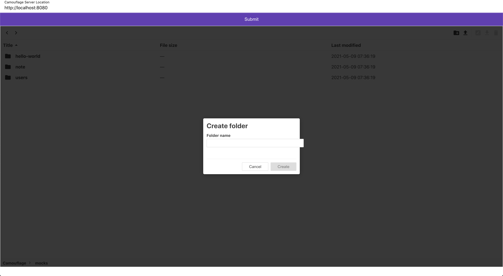
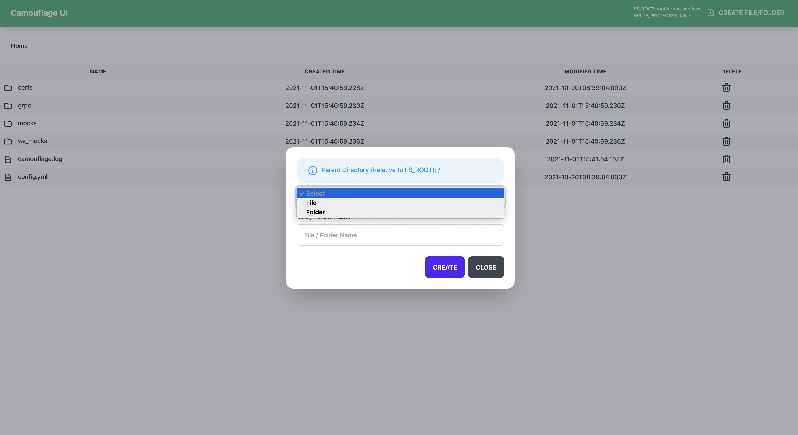
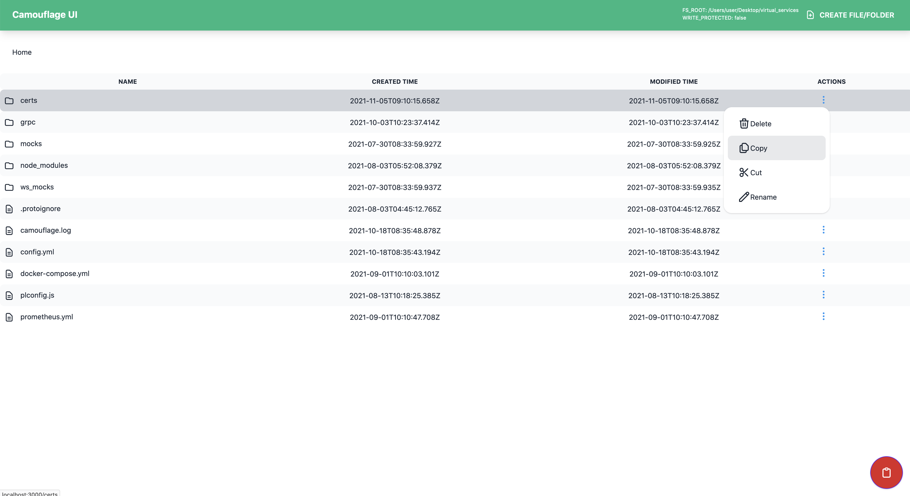

# Camouflage UI

Camouflage also provide a file explorer UI allowing you to work with your mocks. UI is powered by [OpusCapita/filemanager](https://github.com/OpusCapita/filemanager){target=\_blank}, which provides abilities to perform following actions on the available mocks:

- Upload mock files
- Download mock files
- Rename a mock folder to change stubbed API endpoint
- Update cert and key
- Download logs
- Download config yaml

!!!caution

        To access Camouflage UI, one of these protocols, i.e. http, https should be enabled.

Screenshots:

