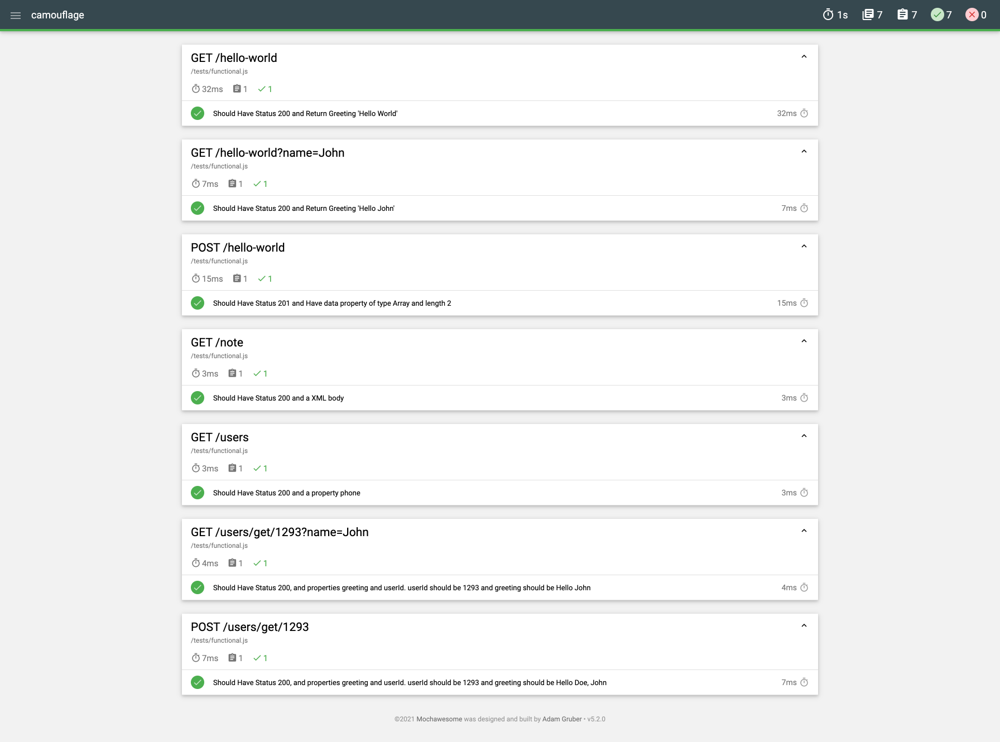

# Tests

### Functional Tests

Following functional tests include the results for 7 example APIs available with Camouflage

### Performance Tests

Performance test was run on a single node process running without any flags.
Test configuration:

- Test tool used was Locust.
- Locust was run in a distributed manner with 1 master and 4 workers on a 12 core machine.

Please note that performance could be further improved by tuning the node js process or running more node js processes under a load balancer.

