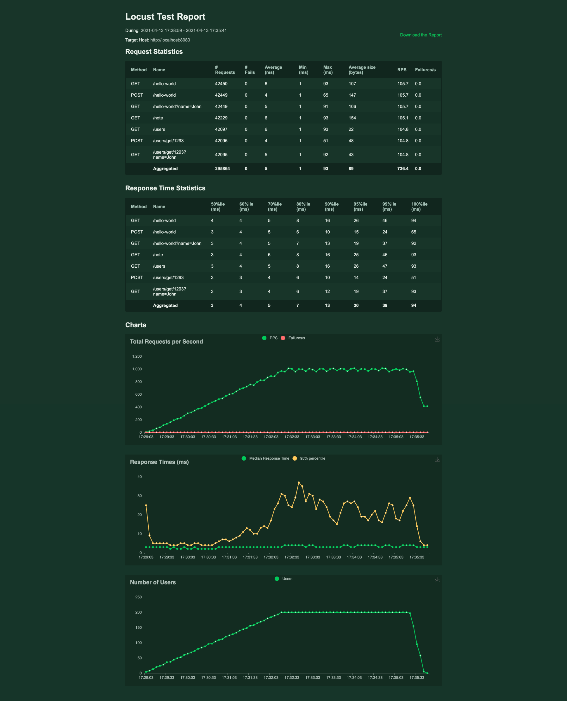

# Tests

## Functional Tests

Following functional tests include the results for 7 example APIs available with Camouflage

## Performance Tests

### Single CPU

This performance test was run on a single node process running without any flags on a single CPU.
Test configuration:

- Test tool used was Locust.
- Locust was run in a distributed manner with 1 master and 4 workers on a 12 core machine.

Please note that performance could be further improved by tuning the node js process or running Camouflage in performance mode.

### Performance mode: 4 CPU

This performance test was on 4 node worker processes without any flags on 4 CPUs

- Test tool used was Locust.
- Locust was run in a distributed manner with 1 master and 4 workers on a 12 core machine.

